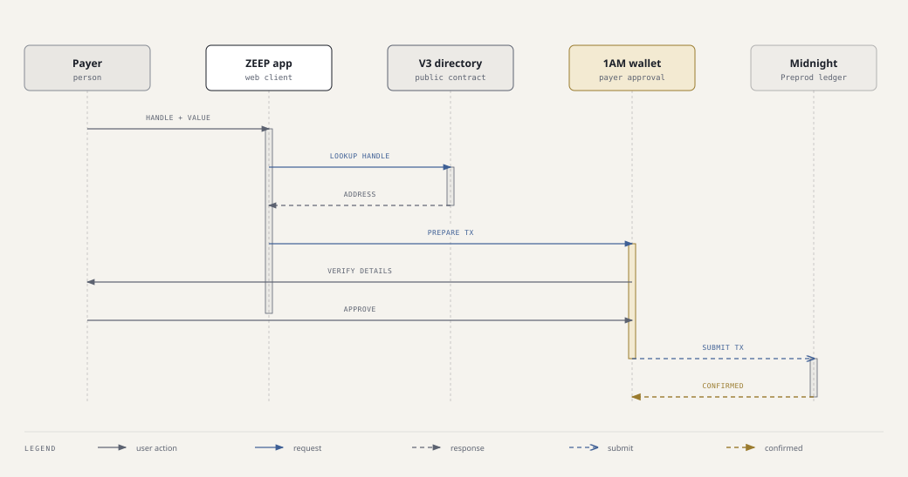

# ZEEP

[](https://github.com/fezco22/zeep/actions/workflows/ci.yml)

**Send tNIGHT to a person by handle.** ZEEP resolves a public handle through a Midnight Preprod directory, then asks the connected 1AM wallet to send native tNIGHT to the mapped unshielded address. ZEEP does not custody funds.

[Open the live app](https://zeep-pink.vercel.app/) · [View the Preprod directory](https://explorer.1am.xyz/contract/5bc1b71c7246a21c5502ff673493a6d6beb9e31c1b18b0508efb9dfe556a6538?network=preprod) · [Follow Zeep on X](https://x.com/paywithzeep)

## How a payment works



The payer checks the destination and amount in 1AM before approving. Transfers of native tNIGHT are public on Preprod. The v3 directory does not verify on-chain that the person registering a handle controls its receiving address, so confirm the mapping with the recipient before sending.

View the [standalone payment-flow diagram](docs/transfer-flow.html).

## What the app does

- Register a handle in the public v3 directory.
- Resolve a handle to its registered unshielded address.
- Prepare and submit a native tNIGHT transfer with the connected 1AM wallet.
- Show wallet-specific activity for actions the app can associate with the connected wallet.

An example 100 tNIGHT transfer is available on the [Preprod explorer](https://explorer.1am.xyz/tx/2054f9abb2cd7e122e3816a63491b9b6b6d9e6dc2dd9649a3af20b517fa08223?network=preprod).

## Network and deployment

| Component | Details |
| --- | --- |
| App | [zeep-pink.vercel.app](https://zeep-pink.vercel.app/) |
| Network | Midnight Preprod |
| Directory contract | [`5bc1b71c…556a6538`](https://explorer.1am.xyz/contract/5bc1b71c7246a21c5502ff673493a6d6beb9e31c1b18b0508efb9dfe556a6538?network=preprod) |
| Wallet | 1AM |
| CI | [GitHub Actions](https://github.com/fezco22/zeep/actions/workflows/ci.yml) |

## Development

### Requirements

- Node.js 22 and npm
- Compact compiler 0.31.1, installed by `fetch-compactc`
- A compatible 1AM wallet for live Preprod interactions

### Run locally

```bash
cd contract
npm ci
npx fetch-compactc --version=0.31.1
npm run compile
npm run compile:v2

cd ui
npm ci
npm run dev -- --host 127.0.0.1 --port 5173 --strictPort
```

The app is available at `http://127.0.0.1:5173`. The UI setup copies the compiled proving assets for the active v3 directory and archived v2 directory.

### Checks

Run these after installing dependencies in both `contract/` and `contract/ui/`:

```bash
cd contract
npm test
npm run build

cd ui
npx tsc --noEmit -p tsconfig.json
npm run build
```

GitHub Actions runs contract compilation, tests, UI typechecking, and the production UI build on pushes and pull requests.

## Technical notes

- The v3 directory maps public handles to unshielded receiving addresses. Its registration circuit does not authenticate ownership of the supplied address; see [registration ownership notes](docs/REGISTRATION_AUTH.md).
- Native tNIGHT transfers are public. A handle is a convenient destination lookup, not a privacy layer for the transfer.
- Activity is wallet-specific and is not a global transaction index. Incoming activity depends on what the connected wallet and indexer expose.
- The app uses the v3 directory by default. Set `VITE_ZEEP_USE_V2=1` to use the archived v2 directory for local comparison, or `VITE_ZEEP_V3_ADDRESS` to point the app at another v3 deployment.

## Documentation

- [Feedback process](docs/FEEDBACK.md)
- [Two-wallet Preprod smoke test](docs/PREPROD_SMOKE_TEST.md)
- [Registration ownership notes](docs/REGISTRATION_AUTH.md)

## Repository layout

```text
contract/src/       Active Compact directory contract
contract/test/      Contract and payment-flow tests
contract/ui/        Web app
contract/v2/        Archived v2 contract and proving assets
docs/               Technical and operational notes
```
